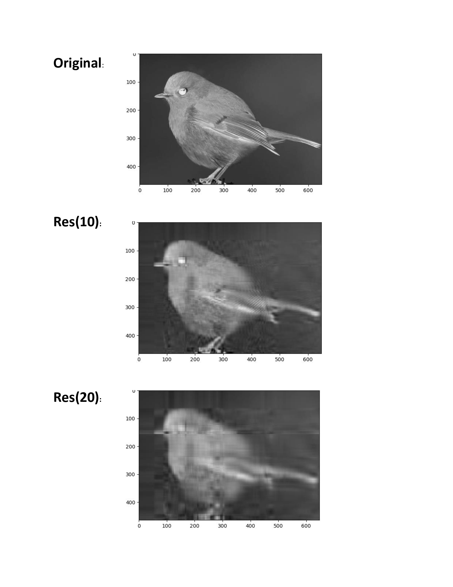

# SVD-in-ImageCompression-
In this method, digital image is given to SVD. SVD refactors the given digital image into three matrices. Singular values are used to refactor the image and at the end of this process, image is represented with smaller set of values, hence reducing the storage space required by the image.

#Result

